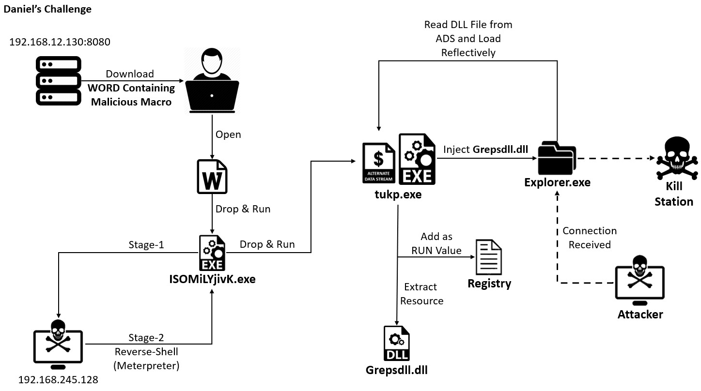

# ExplorerKillSwitch

> **Note**: To a more advanced malware written with modern `C++` features and OOP in mind, I recommend checking out [The SubZero Project](https://github.com/DanielAvinoam/TheSubZeroProject).

A basic `C++` WinAPI malware that grants the attacker a remote kill switch. This malware utilizes a reflective DLL loader and NTFS alternate data streams to hide modules and data.

The complete attack flow looks like this: 

# Disclaimer  
  
**This repository does not promote any hacking related activity. All the information in this repository is for educational purposes only.**  
  
I take **NO** responsibility and/or liability for how you choose to use any of the source code available here. By using any of the files, you acknowledge that **you are using at your own risk**.  
  
In addition, this repository also contain a use of Microsoft's undocumented functions and structures. Using those is extremely dangerous and not recommended. **I do not promote this kind of code in any way**.  
